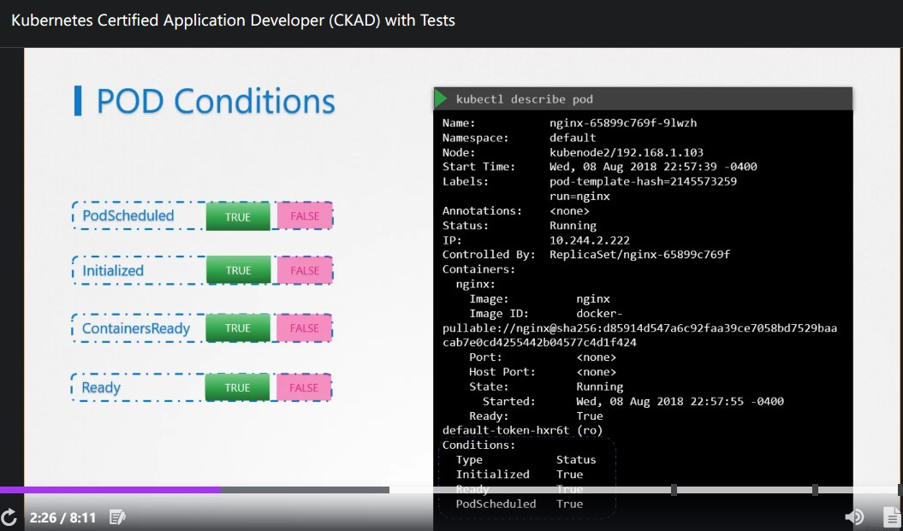
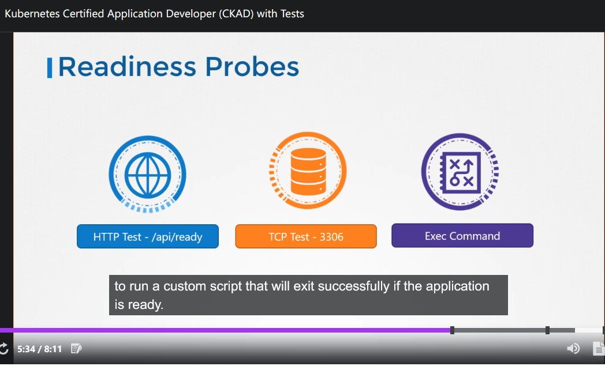
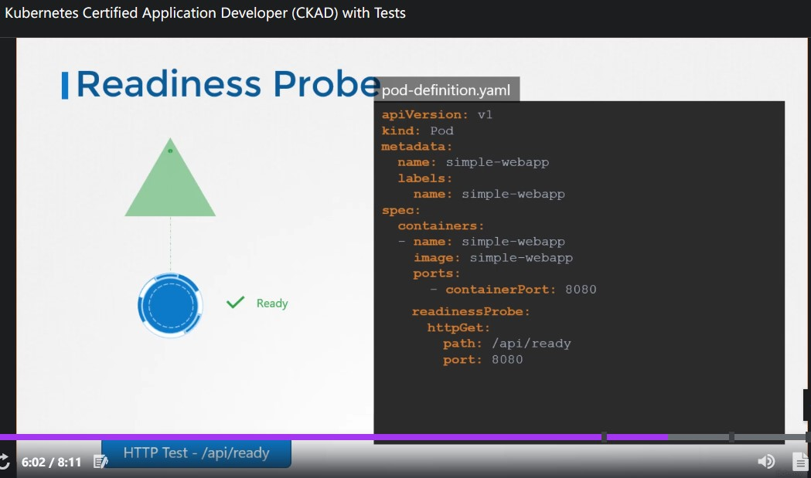
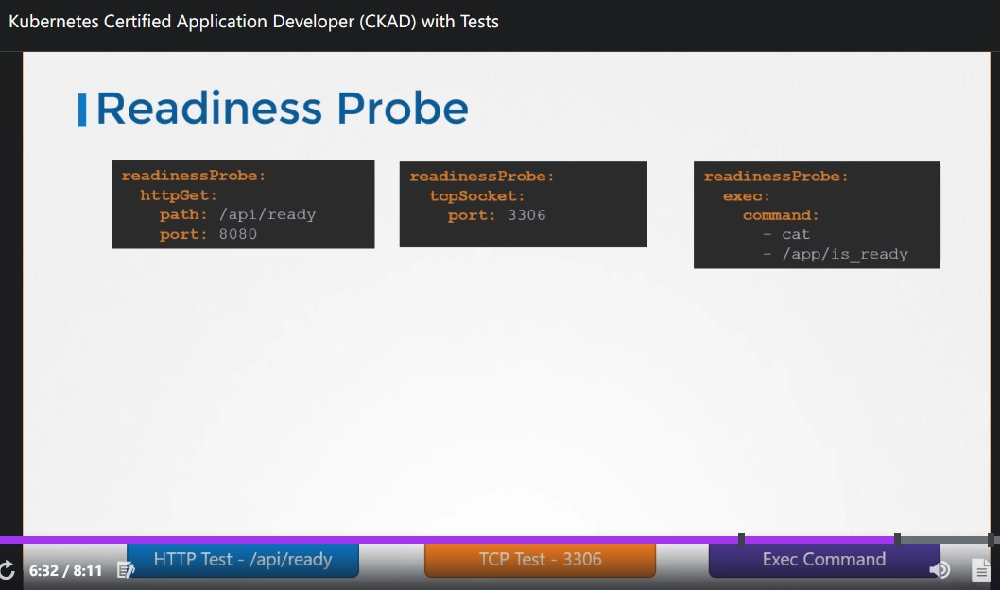
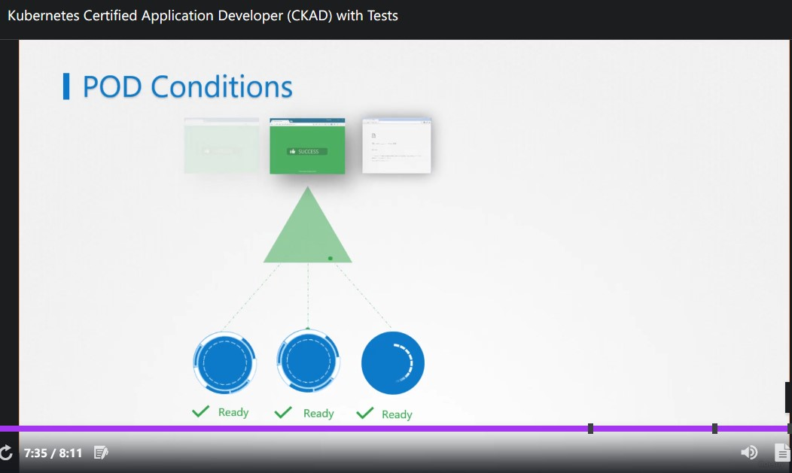

# CKAD Note Section 5 Observability

## 70. Readiness and Liveness Probes

 

### Readiness Probes

透過前面的章節我們可以得知 `Pod` 具有狀態 (status) 與 條件 (condition)，前者顯示 lifecycle 階段 (pending, containerCreating, running)

- pending: scheduler 正在安排 `pod` 到 worker-node 上，或者有問題 (`kubectl describe` 可以查)
- containerCreating: `pod` 已經被放在 worker-node 上，正在建立容器
- running: 執行中

Condition 的部分就有點類似細項，透過 `kubectl describe` 可以觀察。

 

▲ `pod` condition 項目列表

 

不過在這麼多項目當中，在這個章節我們只關心 **ContainersReady 與 Ready**\
依據不同 Application 種類，當 ContainersReady 後會需要一些時間來準備提供服務。**所以當 `Ready == True` 時才是這個 `pod` 可以提供服務的時候。**\
這個章節主要是介紹如何請 K8s 去偵測 `pod` 裡面的服務 Are ready to serve。

 

▲ readiness probe method 總共有這幾個: HTTP GET / TCP / Exec command

 

▲ HTTP GET 範例

 

▲ 所有 method 範例

 

**另外還有三個常用的參數: `initialDelaySeconds`, `periodSeconds`, `failureThreshold` 可以被設定**

- `initialDelaySeconds`: 首次探測前 delay，如果已知這個 Application 勢必會花超過 n 秒那就不用請 K8s 一開始就去煩人家。
- `periodSeconds`: How often，間隔多久探測一次 (單位: 秒)。
- `failureThreshold`: 最高失敗幾次，預設次數 `3` (當達到上限，以 readniness probe 來說 `Pod` 會被 mark 成 un-ready)

 

▲ 如果在 `pod` 內沒有設定 readiness probe 的話，就很有可能發生 service 把流量導到尚未 ready to serve 的 `pod` 身上。

 

**`kubectl get pods` 只能看到 status， `kubectl describe pod` 才能看到 condition。**

---

## 71. Liveness probe

 